# Credit Risk Analysis

## Overview of the Analysis

The purpose of this analysis was to evaluate and predict individual customer credit risk using Supervised Machine Learning algorithms. Since credit risk is an inherently unbalanced classification problem, where good loans easily outnumber risky loans, a variety of machine learning algorithms was used to predict credit risk, such as,

**Resampling Techniques**
* Naive Random OverSampling
* SMOTE Oversampling 
* Cluster Centroids Undersampling
* SMOTEENN (Combination of Over and Under Sampling)

**Ensemble Learning Technique**
* Balanced Random Forest Classifier
* Easy Ensemble AdaBoost Classifier

In the Naive Random OverSampling and SMOTE algorithms, the data was oversampled, and in Cluster Centroids algorithm, the data was undersampled. In SMOTEENN algorithm a combination of over- and undersampling was used. The details of the analysis can be found in the code, [credit_risk_resampling.ipynb]. A comparison between two new machine learning models that reduce bias, Balanced RandomForest Classifier and Easy Ensemble Classifier, was made to predict credit risk. The details of this analysis can be found in the code, [credit_risk_ensemble.ipynb](https://github.com/dshetty100/Credit_Risk_Analysis/blob/main/credit_risk_ensemble.ipynb)

The models were run and then evaluated for performance and accuracy at predicting credit risk.

The analysis was performed using imbalanced-learn and scikit-learn libraries to train and evaluate the models. The credit card credit dataset (LoanStats_2019Q1) from LendingClub, a peer-to-peer lending services company, was utilised for the analysis. After cleaning the data, the dataset consisted of 68,470 entries, and was heavily unbalanced, with only 0.5% of entries being classified as "high-risk."

## Results

The balanced accuracy scores and the precision and recall (sensitivity) scores of all six machine learning models is discussed below.

* **Cluster Centroids Undersampling** gave an accuracy score of 0.5365 and had the lowest accuracy score among all the models that were tested. The model shows only 54% accuracy at predicting credit risks.
    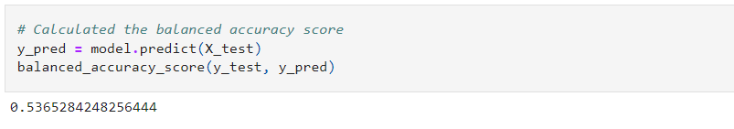

    The average F-score was 0.57 and an F-score for high-risk prediction was only 0.01.
    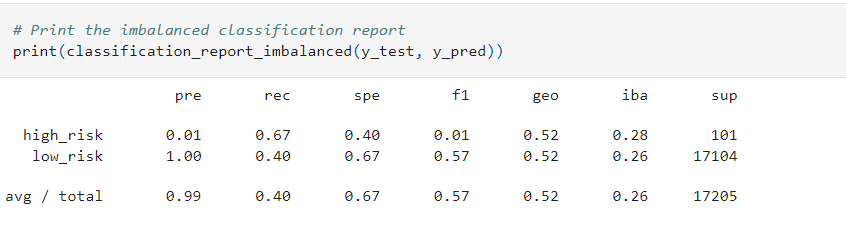

* **SMOTEENN (Combination of Over and Under Sampling)** gave an accuracy score of 0.6579. The model shows 66% accuracy at predicting credit risks. 
    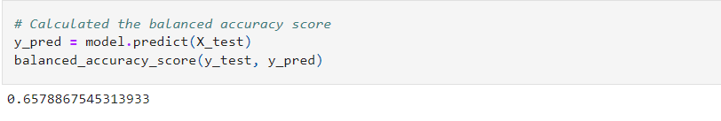

    The average F-score was 0.72 and an F-score for high-risk prediction was only 0.02.
    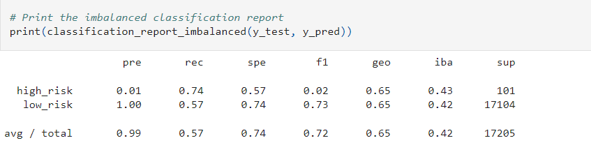

* **SMOTE Oversampling** gave an accuracy score of 0.6539, which is about the same as that for **SMOTEENN (Combination of Over and Under Sampling)**. The model shows 65% accuracy at predicting credit risks.
    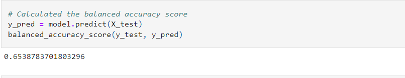

    The average F-score was 0.79 and F-score for high-risk prediction was still 0.02.
    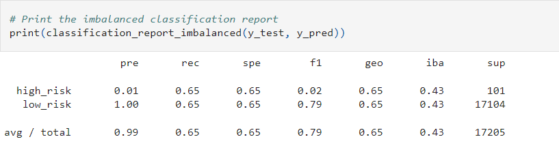

* **Naive Random Oversampling** gave an accuracy score of 0.6804, which is still very similar to what we saw from **SMOTEENN (Combination of Over and Under Sampling)** and **SMOTE Oversampling**. This model shows an accuracy of 68% at predicting credit risks.
    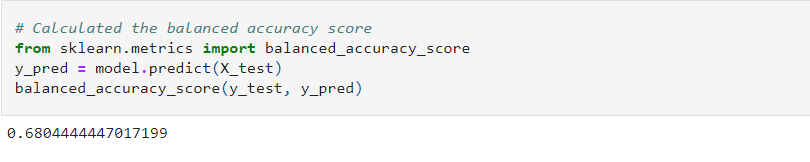

    The average F-scores was on-par with **SMOTE Oversampling** with a value of 0.77 and F-score for high-risk prediction of only 0.02.
    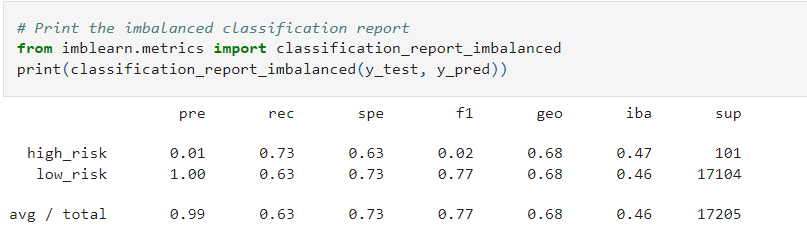

* **Balanced Random Forest Classifier** gave an accuracy score of 0.7615 and showed slight improvement over previous models. The model accuracy for predicting credit risk was about 76%.
    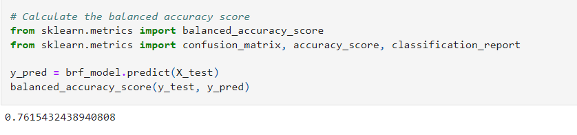

    The average F-score showed significant improvement with a value of 0.92. However, it's F-score for high-risk prediction was still low, at only 0.06.    
    

* **Easy Ensemble AdaBoost Classifier** gave an accuracy score of 0.97 and was among the best performing model. It predicted an accuracy rate of 97% of the appropriate levels of credit risks.
    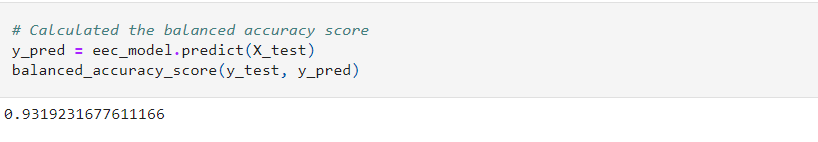

    The averge F-score also showed significant improvement with a value of 0.97. However, it's F-score for high-risk prediction was still low, at only 0.16.      
    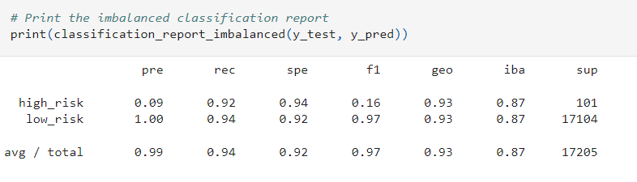

## Summary
The results are presented in ascending levels of performance, based on their balanced acuracy scores, starting with the worst-performing model and moving to the best.

In conclusion, credit-risk is a difficult thing to predict, even for advanced machine learning algorithms with 93 columns of data to process. While the **Easy Ensemble AdaBoost Classifier** model had the highest overall accuracy, this was largely due to the fact that the dataset was so radically unbalanced. Even when it's balanced accuracy and average F-score were above 90%, it's F-score for high-risk prediction was no better than 0.16. In the end, I would advise against using any of these algorithms, as it would put creditors as too great of risk being unable to accurately predict who the high-risk clients/debtors would be.